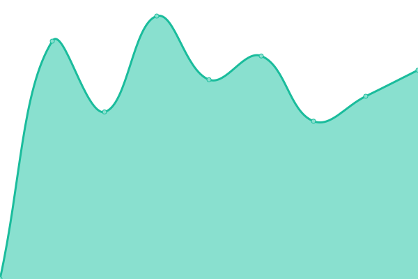
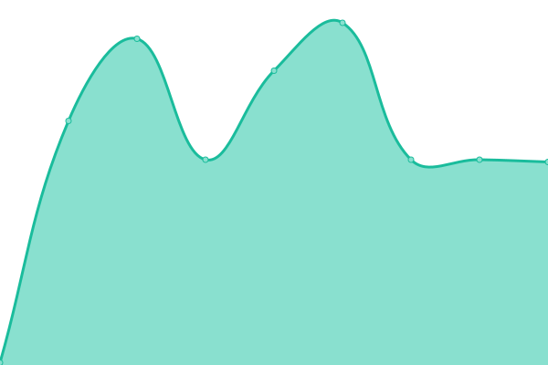

# [📈 Live Status](https://demo.upptime.js.org): <!--live status--> **🟥 Complete outage**

This repository contains the open-source uptime monitor and status page for [Representaciones Pedraja](https://pedraja.es), powered by [Upptime](https://github.com/upptime/upptime).

With [Upptime](https://upptime.js.org), you can get your own unlimited and free uptime monitor and status page, powered entirely by a GitHub repository. We use [Issues](https://github.com/representaciones-pedraja/status/issues) as incident reports, [Actions](https://github.com/representaciones-pedraja/status/actions) as uptime monitors, and [Pages](https://demo.upptime.js.org) for the status page.

<!--start: status pages-->
<!-- This summary is generated by Upptime (https://github.com/upptime/upptime) -->
<!-- Do not edit this manually, your changes will be overwritten -->
<!-- prettier-ignore -->
| URL | Status | History | Response Time | Uptime |
| --- | ------ | ------- | ------------- | ------ |
|  [Tienda](https://www.pedraja.es) | 🟥 Down | [tienda.yml](https://github.com/Representaciones-Pedraja/status/commits/HEAD/history/tienda.yml) | 

 93ms
     
 | 

<a href="https://demo.upptime.js.org/history/tienda">1.17%</a>
    

|  [Facturacion](https://odoo.pedraja.es) | 🟥 Down | [facturacion.yml](https://github.com/Representaciones-Pedraja/status/commits/HEAD/history/facturacion.yml) | 

 62ms
     
 | 

<a href="https://demo.upptime.js.org/history/facturacion">0.00%</a>
    

|  [Cloud](https://cloud.pedraja.es) | 🟥 Down | [cloud.yml](https://github.com/Representaciones-Pedraja/status/commits/HEAD/history/cloud.yml) | 

 74ms
     
 | 

<a href="https://demo.upptime.js.org/history/cloud">0.00%</a>
    

|  [Mail](https://webmail.pedraja.es) | 🟥 Down | [mail.yml](https://github.com/Representaciones-Pedraja/status/commits/HEAD/history/mail.yml) | 

 52ms
     
 | 

<a href="https://demo.upptime.js.org/history/mail">100.00%</a>
    

|  [IPv6 test](forwardemail.net) | 🟥 Down | [i-pv6-test.yml](https://github.com/Representaciones-Pedraja/status/commits/HEAD/history/i-pv6-test.yml) | 

 0ms
     
 | 

<a href="https://demo.upptime.js.org/history/i-pv6-test">100.00%</a>
    

<!--end: status pages-->

[**Visit our status website →**](https://demo.upptime.js.org)

## 📄 License

- Powered by: [Upptime](https://github.com/upptime/upptime)
- Code: [MIT](./LICENSE) © [Anand Chowdhary](https://anandchowdhary.com), supported by [Pabio](https://pabio.com)
- Data in the `./history` directory: [Open Database License](https://opendatacommons.org/licenses/odbl/1-0/)
